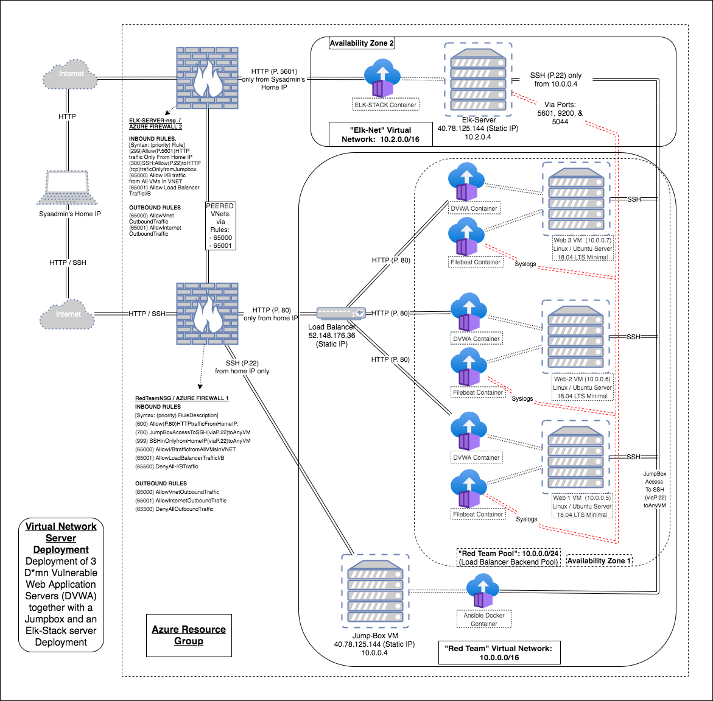
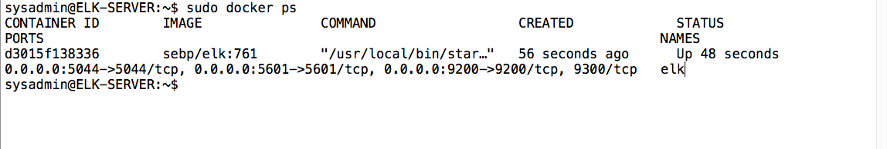

# Cloud Network
# This is a collection of Ansible Scripts to make a Virtual Network with 3 DVWA servers.

## Automated ELK Stack Deployment

The files in this repository were used to configure the network depicted below.



These files have been tested and used to generate a live ELK deployment on Azure. They can be used to recreate the entire deployment pictured above. Alternatively, select portions of the configuration files may be used to install only certain pieces of it, such as Filebeat.

filebeat-config.yml

This document contains the following details:
- Description of the Topology
- Access Policies
- ELK Configuration
  - Beats in Use
  - Machines Being Monitored
- How to Use the Ansible Build
- Ansible Container Configuration 
- Conclusion

<br />

### Description of the Topology

The main purpose of this network is to expose a load-balanced and monitored instance of DVWA, the D*mn Vulnerable Web Application.

Load balancing ensures that the application will be highly **available, stable, and with plenty of redundancy**, in addition to restricting **inbound access** to the network.  The load balancer works as a traffic manager distributing HTTP traffic to the three DVWA Web Servers as evenly as possible increasing stability.  It also works as a single point of entry for all HTTP traffic to the DVWA Web Servers, making it easier to monitor inbound and outbound traffic by limiting the points of entry to one point, port 80, in the network.
Through the use of a Jumpbox and an additional Ansible Docker-container (inside the Jumpbox), we protect the DVWA Web Servers by only allowing the sysadmin team to be able to access the DVWA Web Servers only through the Ansible container via SSH only.  This is done by setting up two firewall rules: (a) one that only allows SSH access with RSA key on port 22 to the Jumpbox only from the sysadmin's home IP, and (b) another rule that only allows SSH access on port 22 to all the VMs in the VNet from the Jumpbox with an RSA key only.  This reinforces an airtight approach to cloud management.

Integrating an ELK server allows users to easily monitor the vulnerable VMs for changes to the files and system resources from outside the network by efficiently analyzing and normalizing systemlogs.  The ELK stack is a compilation of three popular open-source projects: Elasticsearch, Logstash, and Kibana.  Aside from running Elasticsearch, Logstash, and Kibana, it also runs beats.  This Elk-Stack deployment runs these two beats: Filebeat and Metricbeat.   
- Filebeat is a system designed to monitor changes to any and all **files** in the DVWA servers on an on-going basis.
- Metricbeat monitors changes to any and all **system resources** in the DVWA Web servers ongoingly.
- Together, Filebeat and Metricbeat and the ELK server increase the security of the servers by carrying out all monitoring activities through their respective containers (See diagram above), further limiting any direct interaction with the DVWA Web Servers, as well as watch system metrics, such as CPU usage; attempted SSH logins; sudo escalation failures; etc.


<br />

The configuration details of each machine may be found below.

| Name         | Function  | IP Address | Operating System               |
|--------------|-----------|------------|--------------------------------|
| Jump Box     | Gateway   | 10.0.0.4   | Linux/Ubuntu 18.04 LTS Minimal |
| Web Server 1 | Web Server| 10.0.0.5   | Linux/Ubuntu 18.04 LTS Minimal |
| Web Server 2 | Web Server| 10.0.0.6   | Linux/Ubuntu 18.04 LTS Minimal |
| Web Server 3 | Web Server| 10.0.0.7   | Linux/Ubuntu 18.04 LTS Minimal |
| ELK Server   | Monitoring| 10.2.0.4   | Linux/Ubuntu 18.04 LTS Minimal |

As mentioned Earlier, Azure has provisioned a **load balancer** in front of all machines except for the Jumpbox. The load balancer's targets are organized into the following availability zones:
- **Availability Zone 1**: Web Server 1 + Web Server 2 + Web Server 3
- **Availability Zone 2**: ELK Server

<br />

## ELK Server Configuration

The ELK VM exposes an Elastic Stack instance. **Docker** is used to download and manage an ELK container.

Rather than configure ELK manually, we opted to develop a reusable Ansible Playbook to accomplish the task. This playbook is duplicated below.

To use this playbook, one must log into the Jump Box, then issue: `ansible-playbook install_elk.yml elk`. This runs the `install_elk.yml` playbook on the `elk` host.

<br />

### Access Policies
The machines on the internal network are _not_ exposed to the public Internet. Only the three DVWA containers (housed inside the DVWA servers) and the ELK-STACK container (housed inside the Elk-Server) are exposed.

Only the **Jumpbox** VM can accept connections from the Internet as described in he rules mentioned above as well as in the rules noted on the diagram. Access to this machine is only allowed from sysadmins home IP address as long as they are using a computer with the pgp Key used to create the Jumpbox.

Machines _within_ the peered networks can only be accessed by **each other**. The DVWA Web Server 1, DVWA Web Server 2, and the DVWA Web Server 3 send traffic to the ELK server.  See the firewall rules on the diagram above.

<br />

A summary of the access policies in place can be found in the table below.


| Name     | Publicly Accessible | Allowed IP Addresses                              | 
|----------|---------------------|---------------------------------------------------|
| Jump Box | Yes                 | XXX.XXX.32.82 (sysadmin's home IP)                |
| ELK      | No                  | 10.0.0.1-254 & 10.2.0.1-254 & (sysadmin's home IP)|
| DVWA 1   | No                  | 10.0.0.1-254 & 10.2.0.1-254                       | 
| DVWA 2   | No                  | 10.0.0.1-254 & 10.2.0.1-254                       | 
| DVWA 3   | No                  | 10.0.0.1-254 & 10.2.0.1-254                       | 

<br />

### Elk Configuration

Ansible was used to automate configuration of the ELK machine. No configuration was performed manually, which is advantageous because ansible allows us to automate and quickly redeploy all dockers in our network. 

The playbook implements the following tasks:
- Installs needed files
- Configures the server and programs
- launches the docker container that has the configured Elk Stack (ex: Filebeat, Metricbeat)

The following screenshot displays the result of running `docker ps` after successfully configuring the ELK instance.



<br />

The elk-server playbook is shown below.
```yaml
---
# install_elk.yml
- name: Configure Elk VM with Docker
  hosts: elk
  remote_user: sysadmin
  become: true
  tasks:
    # Use apt module
    - name: Install docker.io
      apt:
        update_cache: yes
        name: docker.io
        state: present

      # Use apt module
    - name: Install pip3
      apt:
        force_apt_get: yes
        name: python3-pip
        state: present

      # Use pip module
    - name: Install Docker python module
      pip:
        name: docker
        state: present

      # Use sysctl module
    - name: Use more memory
      sysctl:
        name: vm.max_map_count
        value: "262144"
        state: present
        reload: yes

      # Use docker_container module
    - name: download and launch a docker elk container
      docker_container:
        name: elk
        image: sebp/elk:761
        state: started
        restart_policy: always
        published_ports:
          - 5601:5601
          - 9200:9200
          - 5044:5044

      # Use systemd module
    - name: Enable service docker on boot
      systemd:
        name: docker
        enabled: yes
```
<br />

### Target Machines & Beats
This ELK server is configured to monitor the following machines:
- DVWA Web Server 1 at `10.0.0.5`
- DVWA Web Server 2 at `10.0.0.6`
- DVWA Web Server 3 at `10.0.0.7`

As mentioned above, the Elk Server runs Beats.  These Beats allow us to collect the following information from each machine:
- **Filebeat**: Filebeat detects changes to the filesystem. Specifically, we use it to collect Apache logs.
- **Metricbeat**: Metricbeat detects changes in system metrics, such as CPU usage. We use it to detect SSH login attempts, failed `sudo` escalations, and CPU/RAM statistics.

<br />

The playbook below installs filebeat on the target hosts:
```yaml
---
- name: Installing and Launch Filebeat
  hosts: webservers
  become: yes
  tasks:
    # Use command module
  - name: Download filebeat .deb file
    command: curl -L -O https://artifacts.elastic.co/downloads/beats/filebeat/filebeat-7.4.0-amd64.deb

    # Use command module
  - name: Install filebeat .deb
    command: dpkg -i filebeat-7.4.0-amd64.deb

    # Use copy module
  - name: Drop in filebeat.yml
    copy:
      src: /etc/ansible/files/filebeat-config.yml
      dest: /etc/filebeat/filebeat.yml

    # Use command module
  - name: Enable and Configure System Module
    command: filebeat modules enable system

    # Use command module
  - name: Setup filebeat
    command: filebeat setup

    # Use command module
  - name: Start filebeat service
    command: service filebeat start
        # Use systemd module
  - name: Enable service metricbeat on boot
    systemd:
      name: metricbeat
      enabled: yes
```
<br />

The playbook below installs metricbeat on the target hosts:
```yaml
  ---
- name: Install metric beat
  hosts: webservers
  become: true
  tasks:
    # Use command module
  - name: Download metricbeat
    command: curl -L -O https://artifacts.elastic.co/downloads/beats/metricbeat/metricbeat-7.4.0-amd64.deb

    # Use command module
  - name: install metricbeat
    command: dpkg -i metricbeat-7.4.0-amd64.deb

    # Use copy module
  - name: drop in metricbeat config
    copy:
      src: /etc/ansible/files/metricbeat-config.yml
      dest: /etc/metricbeat/metricbeat.yml

    # Use command module
  - name: enable and configure docker module for metric beat
    command: metricbeat modules enable docker

    # Use command module
  - name: setup metric beat
    command: metricbeat setup

    # Use command module
  - name: start metric beat
    command: service metricbeat start

    # Use systemd module
  - name: Enable service filebeat on boot
    systemd:
      name: filebeat
      enabled: yes
```
<br />

To recap:

The playbook for elk-server is the `install_elk.yml`

The playbook for filebeat is the `filebeat-playbook.yml`

The playbook for metricbeat is the `metricbeat-playbook.yml`

You may find these three `.yml` files in the Ansible directory within this repo.

<br />

## Using the Playbook

In order to use the playbook, you will need to have an Ansible control node already configured. Please see the section below called _Ansible Container Configuration_ to see how to set up and configure the Ansible control node (or container). Assuming you have such a control node already set up, proceed with the following steps to use the playbook: 

SSH into the Ansible container and follow the steps below:
- Copy the filebeat-config.yml file to the ansible container and save it into the correct location as indicated inside the yml files above.

- Use a similar process for the elk-server and when installing metricbeat.

- Update the hosts file in the ansible container in order to run the playbook on a specific VM.

- To find the hosts file and the Playbook files from inside the ansible container and run:

    `root@1c9a7e246652:~# cd /etc/ansible`

- Once inside the ansible directory referenced above, run `ls -la` and you’ll see all the necessary files as in this example below: 

```
root@1c9a7e246652:/etc/ansible# ls -la
total 48
-rw-r--r-- 1 root root 19988 Mar 16 02:45 ansible.cfg      
-rw-r--r-- 1 root root  1232 Mar 20 20:24 hosts         <---
-rw-r--r-- 1 root root     0 Mar 20 20:31 install-elk.yml    <---
-rw-r--r-- 1 root root   683 Mar 16 03:46 myplaybook.yml    <---
drwxr-xr-x 2 root root  4096 Dec  4  2019 roles
```

- Update the hosts file to include the correct internal IP address for the ELK server and each webserver as shown below:

```bash
    hosts
    [webservers]
    10.0.0.5 ansible_python_interpreter=/usr/bin/python3
    10.0.0.6 ansible_python_interpreter=/usr/bin/python3
    10.0.0.7 ansible_python_interpreter=/usr/bin/python3
    
    [elk]
    10.2.0.4 ansible_python_interpreter=/usr/bin/python3
```

- Run the playbook with this command from directory that contains the specific playbook you are running.  for example, run the install_elk.yml playbook from the ansible directory as shown below:
`root@1c9a7e246652:/etc/ansible# ansible-playbook install_elk.yml elk`

- Use these commands to run the playbooks:

    `$ ansible-playbook install_elk.yml elk` (when installing the elk container)

    `$ ansible-playbook filebeat-playbook.yml webservers`  (when installing the filebeat container)

    `$ ansible-playbook metricbeat-playbook.yml webservers` (when installing the metricbeat container)


- Navigate to the specific Docker host you've configured via SSH to check that the installation worked as expected.  Once inside the host VM, You can then run this:

    `$ sudo docker ps` 
    
    This is also shown above along with a sample it’s the output.

- To check the configuration of our Elk-server's with Kibana, we run the following from the elk-server:
    
    `sysadmin@ELK-SERVER:~$ curl localhost:5601/app/kibana`

- Alternatively, We can verify that we can load the elk stack server from our web browser at the kibana site by running this:  

    `http://[your.ELK-VM.External.IP]:5601/app/kibana`  
    [Example:  `http://40.78.125.144:5601/app/kibana`]

<br />

# Ansible Container Configuration #

The Ansible Docker Container is located inside the Jumpbox and serves as a way to increase the distance and further segment the DVWA Web Servers from direct contact to public internet traffic.  The main purpose of deploying the Ansible container in this VNet is for sysadmin team to carry out any and all maintenance of the virtual network from the Ansible Container only.
This allows the sysadmin team to have much more control over monitoring traffic and monitoring any type of communication taking place within the VMs inside the VNet.  That is, if we identify traffic, communication, or activities from inside our network that is not coming from this ansible container via SSH on port 22, and it is also not coming from our VM's in the VNet, then it is an intruder who must be removed immediately.  


Below is a list of commands and procedures necessary to configure and run the Ansible Container.

- To SSH into our Jumpbox from our home terminal.

`$ ssh -i /Users/[User]/.ssh/id_rsa [Jumpbox_public_IP]`

- To install Docker in the Jumpbox. 

`$ sudo apt install docker.io`

- To install and create an Ansible-Docker Container while inside the Jumpbox. 

`$ sudo docker run -ti cyberxsecurity/ansible bash`

- This **starts** the Ansible Docker container

`$ sudo docker start`

- After this, we follow a 3-step process to get into the Ansible container.  We "list", "start" (initiates the container) and "attach" (lets us into the container) as follows:

- This **lists** the number of containers that are loaded into the system (on future login attempts, we may find some of containers running as run this command)

`$ sudo docker container list -a`

        You will see one or more ansible containers running.  Find the name of the container you've been working with.  Stop any unnecessary  container instances with this command
           
              `$ sudo docker stop [Container_to_stop]` 


- This command **starts** the Ansible Container.  It initiates the container as if it's getting booted up; that is, you don't get to use it yet.

`$ sudo docker start [YourAnsibleContainer]`

`$ sudo docker start fervent_meninsky`

- This command lets us **attach** (lets us into) the container.  

`$ sudo docker attach [YourAnsibleContainer]`

`$ sudo docker attach fervent_meninsky`

- running that command places you inside the Ansible container, which sould look like this.

`root@1c9a7e246652:~#`

To get off of the Ansible container and the Jumpbox.

`$ exit`


This lightweight, yet robust Ansible container allows us to have access to our network to carry out our system maintenance objectives with a higher level of security by limiting the ports of entry and protocols of communication in the VNet.  This increases our ability to identify abnormal traffic within the network quickly, so we can respond with efficacy to remove any potential intruders.  For monitoring our network on an on-going basis from outside the network, we use the Elk Stack setup (discussed above) running Elasticsearch as well as Logstash, Kibana, and beats (filebeat and Metricbeat).  

To sum it up, the combination of a Jumpbox and Ansible container functioning as a backdoor to the VNet together with the Elk-Stack log search engine, the Load Balancer limiting all public internet traffic to one point of entry while maintaining stability, and the two firewalls limiting traffic and port availability make this Elk-Stack Virtual Network Deployment on Azure a powerful and dynamic, cost effective solution to Cloud computing.  The Elk-Stak is currently one of the most popular and effective Virtual Could Management approaches because it meets a strong need in the log analytics space at very affordable prices.  The Elk-Stack is one of the best choices for small to mid-size organizations.  I'll be happy to answer any questions you may have regarding this Elk-Stack deployment in the Azure cloud.  Thank you for your Time.  I do hope that you now have a deeper understanding of the many benefits and solutions that can be obtained by migrating your physical IT resources to an Elk-Stack virtual network.
